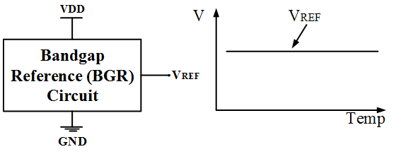
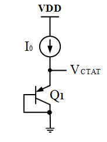
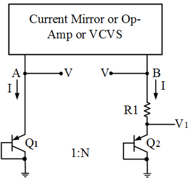
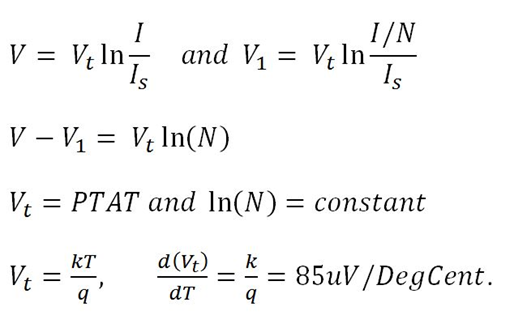
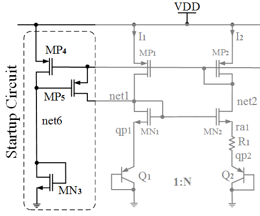

# Bandgap Reference Design Workshop
## Introduction
A bandgap reference is a voltage reference circuit widely used in integrated circuits to produce a stable, temperature-independent output voltage, typically around (the silicon bandgap energy). It operates by summing a voltage with a negative temperature coefficient (CTAT) and a voltage with a positive temperature coefficient (PTAT).
## Table of Contents
- [Why Bandgap Reference?](#why-bandgap-reference)
- [BGR Principle](#BGR-principle)
- [CTAT Voltage Generation](#CTAT-voltage-generation)
- [PTAT Voltage Generation](#PTAT-voltage-generation)
- [Self Bias Current Mirror Circuit](#self-bais-current-mirror-circuit)
- [Design Specification and Device Data Sheet](#device-specification-and-device-data-sheet)
- [Tools and PDK setup](#toola-and-PDK-setup)
- [Spice netlist Setup](#spice-netlist-setup)
- [Prelayout Results](#prelayout-results)
- [Physical layout](#physical-layout)
- [LVS Verification](#LVS-verification)
- [References](#references)
## Why Bandgap Reference
A Bandgap Reference (BGR) is one of the most fundamental blocks in analog IC design — virtually every mixed-signal SoC contains one. Its job is to produce a precise, stable DC voltage that does not change with temperature, supply voltage, or process variation.

## BGR Principle
A Bandgap Reference (BGR) circuit creates a stable voltage (typically) independent of temperature, power supply, and process variations. It works by summing two opposing temperature-dependent voltages: a Complementary to Absolute Temperature (CTAT) voltage (usually a diode) and a Proportional to Absolute Temperature (PTAT) voltage.

## CTAT Voltage Generation
CTAT stands for Complementary to Absolute Temperature. A CTAT voltage is an electronic signal that decreases linearly as the temperature increases. This behavior is primarily used in Bandgap Voltage References to cancel out the positive temperature coefficient of PTAT (Proportional to Absolute Temperature) voltages, resulting in a temperature-stable output.

## PTAT Voltage Generation
PTAT (Proportional To Absolute Temperature) voltage generation is a core technique in analog circuit design used to create a voltage that increases linearly with temperature. It is most commonly used in Bandgap Voltage References to cancel out the negative temperature dependence of a diode (CTAT) and produce a stable, temperature-independent reference.

## Self Bias Current Mirror Circuit
A self-biased current mirror is
a specialized circuit used in integrated circuit design to generate a stable reference current that is independent of supply voltage variations. Unlike basic current mirrors that require an external reference current, a self-biased circuit uses internal feedback loops to "bias itself" into a specific operating state.
The SBCM has two stable operating points:

    I_in = I_out = 0 A (degenerate / undesired)
    The desired bias current

At power-on, the circuit is at the zero-current point. The start-up circuit must:

    Detect the zero-current state and force the circuit out of it.
    Disengage once the correct operating point is reached — otherwise it will corrupt the bias.

Operation:

    Initially, all branch currents = 0 → net2 follows VDD.
    When net2 voltage exceeds net6 by one V_T, current flows through MP5 → net1 rises → MN1/MN2 turn on → circuit reaches the desired operating point.
    Once stable, the start-up circuit is self-defeating: net2 drops to the correct bias level, MP5 turns off, and the start-up path is isolated.

## Start up Circuit
A startup circuit is an auxiliary circuit used to ensure that a system (typically a Bandgap Reference (BGR)) moves from a "zero-current" state to its intended operating state upon power-up. 

## Complete BGR Circuit

## Design Specification and Device Data Sheet
|Block |	Devices |
|-----------------|-----------------------------------|
|Startup 	| MP4, MP5, MN3 |
|SBCM |	MP1, MP2, MN1, MN2
|CTAT branch |	Q1 (1× BJT) |
| PTAT branch |	R1 (5 kΩ), Q2 (8× BJT parallel) |
| Reference branch |	MP3, R2 (33 kΩ), Q3 (1× BJT) |
### Design Specifications
| Parameter |	Target |
|----------------------|-----------------------|
|Supply Voltage |	1.8 V |
|Operating Temperature | 	−40 °C to +125 °C |
|Power Consumption |	< 60 µW |
|Off Current | 	< 2 µA |
|Start-up Time | 	< 2 µs |
| Tempco of V_REF |	< 50 ppm/°C |
### Device Data Sheet
#### MOSFET (LVT,1.8V)
|Parameter |	NFET |	PFET |
|-----------------|-----------|-----------|
|Type |	LVT |	LVT|
|Voltage |	1.8 V |	1.8 V|
|Threshold Voltage |	~0.4 V |	~−0.6 V|
|Sky130 Model |	sky130_fd_pr__nfet_01v8_lvt |	sky130_fd_pr__pfet_01v8_lvt|
#### PNP BJT
|Parameter |	Value|
|------------------|-------------------------------|
|Current Rating 	|1 µA – 10 µA / µm²|
|Beta (β) |	~12|
|Emitter Area |	11.56 µm² (3.40 × 3.40 µm)|
|Sky130 Model |	sky130_fd_pr__pnp_05v5_W3p40L3p40|
#### Resistor RPOLYH
|Parameter	|Value|
|-----------------------|--------------------------------------------|
|Sheet Resistance |	~350 Ω/□|
|Tempco 	|2.5 Ω/°C|
|Available Bin Widths |	0.35 µm, 0.69 µm, 1.41 µm, 2.85 µm, 5.73 µm|
|Sky130 Model |	sky130_fd_pr__res_high_po|
## Circuit Design
Step 1 — Current Calculation
Max power = 60 µW at VDD = 1.8 V → max total current = 33.33 µA.
With 3 branches: 10 µA/branch (3 × 10 = 30 µA, leaving headroom for start-up).

Step 2 — BJT ratio N
A moderate N = 8 BJTs in parallel in branch 2 gives:
    Good layout matching (common-centroid array)
    Moderate R1 value (not too large, keeping area reasonable)

Step 3 — R1 calculation
R 1 = V t ln ⁡ ( N ) I = 26   mV × ln ⁡ ( 8 ) 10.7   μ A ≈ 5   k Ω
Implemented as: W = 1.41 µm, L = 7.8 µm, unit = 2 kΩ → 2 series + 2 parallel (2+2+(2‖2))

Step 4 — R2 calculation
Slope of V_R2 = (R2/R1) × ln(8) × 115 µV/°C
Slope of V_Q3 = −1.6 mV/°C
Setting sum to zero → R2 ≈ 33 kΩ
Implemented as: 16 in series + 2 in parallel (2+2+...+2+(2‖2))

Step 5 — PMOS sizing (SBCM)
MP1, MP2: Both in saturation. Long channel (L = 2 µm) to reduce channel length modulation.
Final size: L = 2 µm, W = 5 µm, M = 4

Step 6 — NMOS sizing (SBCM)
MN1, MN2: Operated in deep sub-threshold to achieve low current with compact area.
Final size: L = 1 µm, W = 5 µm, M = 8

## Final BGR Circuit
 	|Sky130 tech file, magic tech file|
|Netgen |	1.5.185 |	LVS (Layout vs Schematic) |	Sky130 Netgen rule file|

#### Ngspice
Open-source SPICE simulator for electrical circuit simulation. Used to perform DC sweep, transient, and temperature sweeps.
sudo apt-get install ngspice

#### Magic
Berkeley VLSI layout editor — used for drawing layout, running DRC, and extracting parasitics.
wget http://opencircuitdesign.com/magic/archive/magic-8.3.32.tgz
tar xvfz magic-8.3.32.tgz
cd magic-8.3.32
./configure
sudo make
sudo make install

### PDK Setup
This project uses Google SkyWater Sky130 — a 130 nm open-source process design kit.

# Clone primitive device models
git clone https://github.com/google/skywater-pdk-libs-sky130_fd_pr.git

# Clone EDA technology files (Magic tech, Netgen rules, etc.)
git clone https://github.com/silicon-vlsi-org/eda-technology.git

Design Flow Overview:

Schematic Design   ──[Ngspice + Sky130 models]──►  Pre-Layout Simulation
       │
       ▼
 Layout Design     ──[Magic + Sky130 tech file]──►  DRC + PEX
       │
       ▼
      LVS          ──[Netgen + Sky130 rule file]──►  Schematic vs Layout
       │
       ▼
Post-Layout Sim    ──[Ngspice + extracted netlist]──►  Final Verification

### Writing a SPICE Netlist
A SPICE netlist is a text file that describes a circuit — its components, connections, and simulation commands — in a format that ngspicecan read and simulate. Every .sp file in this project follows the same structure.
6.1 Netlist Structure
*  Title / Comment line (must be the first line)
*  ----------------------------
*  1. Include PDK model files
*  ----------------------------
.lib "/path/to/sky130.lib.spice" tt
*  ----------------------------
*  2. Global supply nodes
*  ----------------------------
.global gnd vdd
vdd vdd gnd 1.8
LVS tool — compares the extracted SPICE netlist from Magic against the pre-layout schematic netlist.
git clone git://opencircuitdesign.com/netgen
cd netgen
./configure
sudo make
sudo make install
----------------------------
*  3. Circuit components
*  ----------------------------
* Syntax: ComponentName  Node+ Node-  ModelName  Parameters
* BJT (PNP)
xqp1  vdd  net1  net1  sky130_fd_pr__pnp_05v5_W3p40L3p40  m=1
* MOSFET (PFET)
xmp1  net1  net2  vdd  vdd  sky130_fd_pr__pfet_01v8_lvt  l=2 w=5 m=4
* MOSFET (NFET)
xmn1  net2  net3  gnd  gnd  sky130_fd_pr__nfet_01v8_lvt  l=1 w=5 m=8
* Resistor
xra1  net3  net4  sky130_fd_pr__res_high_po_1p41  l=7.8 w=1.41 m=1
*  ----------------------------
*  4. Simulation commands
*  ----------------------------
.dc temp -40 125 5        * DC sweep: temperature from -40 to 125°C in steps of 5
.control
  run
  plot v(vref)            * Plot the reference voltage node
.endc
.end

## SPICE Simulations
1. CTAT with Single BJT
2. CTAT with Multiple BJT
3. CTAT with varying current
4. PTAT with Ideal voltage source(VCVS)
5. 

